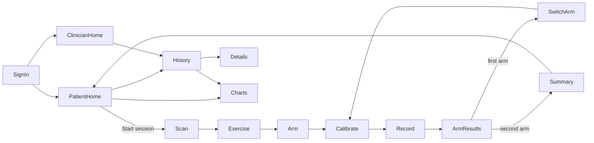
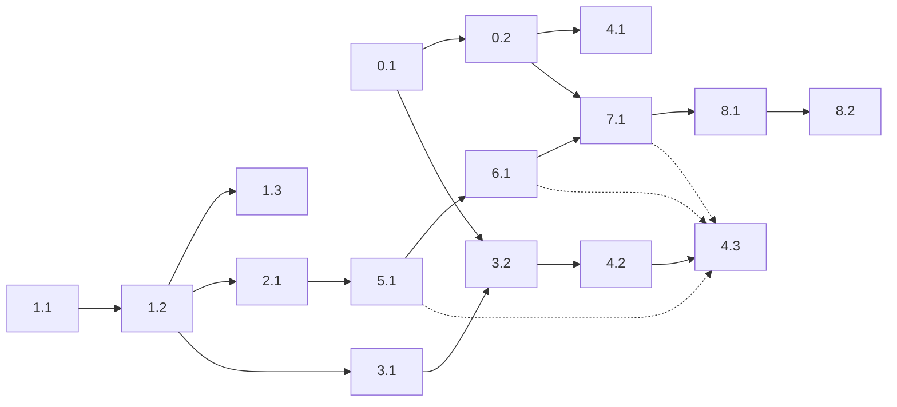

# GETMS — Upper Limb Rehabilitation Tracker
**Design Document v3** · COEN 390

> GETMS = initials of the team members.
> This document matches the GitHub issues. Issue numbers are shown as `(x.y)`.

---

## 1. Overview

A patient wears **one sensor** on the upper arm and does a simple exercise (arm raise). The patient records **one arm, then the other**, using the same sensor. The Android app counts the reps, computes simple metrics for each arm, and compares left and right with an **asymmetry %**. Results are saved in Firebase and shown to the patient and their clinician.

**Users**
| Role | What they do |
|---|---|
| Patient | Records sessions, sees their results and progress |
| Clinician | Sees the list of linked patients and their results |

**Out of scope** (kept simple on purpose): second EMG channel, battery/charging, signal-quality check, raw signal storage/viewer, offline sync, security rules, CI, formal validation, multiple exercises (only Arm Raise), streaks/badges.

---

## 2. System Architecture

```text
 Patient arm
     │
 [IMU + EMG] ──► ESP32 ──── BLE (50 Hz) ────► Android app ──────► Firebase
                 angle                         offset, speed,      Auth
                 EMG envelope                  %MVC, reps,         Firestore
                                               metrics, UI         (users, sessions)
```

| Stage | Where | Why |
|---|---|---|
| Sampling, arm angle, EMG envelope | ESP32 | Needs fixed timing, and only small values are sent over BLE |
| Calibration offset, speed, %MVC, rep counting | App | Needed for live feedback |
| Metrics and asymmetry | App (end of each arm) | Plain Kotlin, easy to change |
| Accounts and sessions | Firebase | No backend code to write |

---

## 3. Hardware (1.1, 1.2, 1.3)

### 3.1 Parts
- ESP32 dev board (esp32dev)
- MPU-6050 IMU (accelerometer + gyroscope)
- 1 EMG sensor module + gel electrodes (single use, buy extras)
- USB power bank + cable
- Small case, velcro strap, jumper wires, breadboard

### 3.2 Wiring
| Component | Pin | ESP32 |
|---|---|---|
| IMU | VCC / GND | 3.3V / GND |
| IMU | SDA / SCL | GPIO21 / GPIO22 |
| EMG | Signal | GPIO34 |
| EMG | Power | per module datasheet |

EMG must be on an **ADC1** pin (GPIO34). ADC2 pins don't work while Bluetooth is on.

### 3.3 Placement
- **Electrodes:** 2 on the front of the shoulder (anterior deltoid), about 2 cm apart along the muscle. Reference electrode on the elbow.
- **Case:** on the side of the upper arm, held by a velcro strap. The IMU is fixed inside the case.
- **Orientation:** an arrow on the case points toward the elbow, so the IMU faces the same way on both arms.
- **Arm switch:** moving the sensor to the other arm must take under 1 minute.

---

## 4. Firmware (1.2, 2.1, 3.1)

- PlatformIO (or Arduino IDE), board `esp32dev`, code in `/firmware`
- `config.h`: pin numbers and BLE UUIDs
- Library: Adafruit MPU6050

### 4.1 Startup (`setup()`)
1. Serial at 115200
2. I2C on GPIO21/22 at 400 kHz
3. MPU-6050 at `0x68`, accel ±4 g, gyro ±500 °/s. Print an error if not found
4. EMG pin GPIO34, 12-bit ADC (0–4095)
5. BLE: name `GETMS`, service + characteristics, start advertising

### 4.2 Timing
| Task | Rate |
|---|---|
| EMG sampling | 1000 Hz (hardware timer) |
| IMU read + angle update | 50 Hz (every 20 ms) |
| Output (BLE notify, or Serial CSV) | 50 Hz (every 20 ms) |

### 4.3 Arm angle (complementary filter)
```text
angle = 0.98 * (angle + gyroRate * dt) + 0.02 * accelAngle      dt = 0.02 s
accelAngle = atan2(two accel axes in the raising plane), in degrees
```
Arm down ≈ 0°, arm straight forward ≈ 90°. The small offset is removed by the app after calibration.

### 4.4 EMG envelope
1. Sample at 1000 Hz
2. Subtract the resting offset (running average)
3. Absolute value
4. Average of the last 100 samples (100 ms)
5. Latest value is sent every 20 ms

If the EMG module has its own envelope output, use it directly.

### 4.5 States
```text
IDLE (advertising) ──connect──► CONNECTED ──START──► STREAMING
        ▲                           ▲                    │
        └──── disconnect ───────────┴──── STOP ──────────┘
```
After a disconnect: stop streaming and restart advertising.

### 4.6 Sample data
Serial CSV `time_ms, angle_deg, emg` recorded to `/data` (slow raises, fast raises, rest, both arms). This data lets the app algorithms be built before the app is ready.

---

## 5. BLE Interface (3.1, 3.2)

| Name | UUID | Property |
|---|---|---|
| Service | `4f8a1000-7c3e-4b9a-9d2e-5a6b1c0d3e7f` | — |
| Data | `4f8a1001-7c3e-4b9a-9d2e-5a6b1c0d3e7f` | Notify (+ BLE2902 descriptor) |
| Control | `4f8a1002-7c3e-4b9a-9d2e-5a6b1c0d3e7f` | Write |

**Data packet** — 12 bytes, little-endian, one notification every 20 ms while streaming:

| Bytes | Type | Field |
|---|---|---|
| 0–3 | uint32 | counter (+1 per sample) |
| 4–7 | float32 | angle (°) |
| 8–11 | float32 | EMG envelope (raw units) |

**Control** — 1 byte: `0x01` = START, `0x00` = STOP.

**Notes**
- The packet fits in the default BLE payload (20 bytes), so there is no MTU change.
- ESP32: send a packed struct.
- Android: `ByteBuffer.wrap(v).order(LITTLE_ENDIAN)` → `getInt, getFloat, getFloat`.
- A gap in the counter means samples were lost (only logged).
- The UUIDs are kept in the README, `config.h` and `BleConstants.kt`.
- Debug the ESP32 side without the app using the **nRF Connect** phone app.

---

## 6. Android App (0.1, 3.2, 4.x, 8.x)

### 6.1 Platform
- Kotlin + Jetpack Compose, min SDK 26, single activity + Navigation Compose
- Firebase Auth + Firestore
- Charts: Vico or MPAndroidChart

### 6.2 Packages
| Package | Content | Issues |
|---|---|---|
| `ble` | scan, connect, packet parser, `Flow<Sample>`, `start()` / `stop()` | 3.2 |
| `processing` | signal functions, rep counter, metrics, asymmetry | 5.1, 6.1 |
| `data` | users, sessions, Firestore functions | 4.1, 7.1 |
| `ui` | screens | 4.x, 8.x |

### 6.3 Navigation

History, Details and Charts take a `patientId`, so patients and clinicians use the same screens. The Scan screen is skipped if the sensor is already connected.

### 6.4 Screens
| Screen | Content | Issue |
|---|---|---|
| Sign up / Sign in | name, email, password, role (+ affected side for patients) | 4.1 |
| Scan | Bluetooth permissions, device list filtered by service UUID, connection status | 3.2 |
| Exercise | hard-coded list (Arm Raise) | 4.2 |
| Arm | Left / Right; the second recording uses the other arm | 4.2 |
| Calibrate | rest 3 s, then max effort 3 s | 4.2 |
| Record | 3-2-1 countdown, live rep counter (`4 / 10`) and angle, auto-stop at target reps or Stop button, screen kept on | 4.3 |
| Arm results | ROM, peak speed, activation, reps, time | 4.3 |
| Switch arm | text + photo: move strap and electrodes to the same spot | 4.3 |
| Summary | left vs right table + asymmetry %, saves the session | 4.3 |
| Patient home | start session, last session card, History, Charts, clinician email field | 8.1, 4.1 |
| History | sessions newest first | 8.1 |
| Details | metric / left / right / asymmetry table | 8.1 |
| Charts | ROM (left and right lines) and ROM asymmetry over time ("lower is better") | 8.1 |
| Clinician home | linked patients with last session date | 8.2 |

### 6.5 Exercise definition (hard-coded)
| Name | Target reps | HIGH | LOW |
|---|---|---|---|
| Arm Raise (front) | 10 | 60° | 20° |

### 6.6 Calibration (once per arm)
1. **Rest:** arm relaxed at the side for 3 s → average angle = **zero offset**
2. **Max effort:** push the arm forward against a wall for 3 s → highest EMG = **MVC**

### 6.7 Android specifics
- **Permissions:** Android 12+ needs `BLUETOOTH_SCAN` and `BLUETOOTH_CONNECT`. Android 11 and lower needs `ACCESS_FINE_LOCATION`. Show a message if denied.
- **Notifications:** `setCharacteristicNotification` + write `ENABLE_NOTIFICATION_VALUE` to descriptor `0x2902`.
- **Screen:** `FLAG_KEEP_SCREEN_ON` while recording.
- **Disconnect:** show a message and a Reconnect button. During a recording, that arm is discarded and redone.

---

## 7. Signal Processing (5.1)

Plain Kotlin functions. Samples arrive at 50 Hz (`dt = 0.02 s`).

| Step | Formula |
|---|---|
| Angle | `angle - zeroOffset` |
| Smoothing | 5-sample moving average |
| Speed (°/s) | `v[i] = (angle[i+1] - angle[i-1]) / (2 * dt)` |
| EMG % | `emgPercent = emg / MVC * 100` (same arm's MVC; above 100% is fine) |

**Rep counter** (works live, one sample at a time):
- angle goes above **HIGH** → arm is up, rep starts
- angle goes back below **LOW** → +1 rep, rep ends
- the start and end sample index of each rep are saved

Two thresholds (hysteresis) stop small shakes from being counted as reps.

---

## 8. Metrics & Asymmetry (6.1)

Each metric is computed **per rep**, then **averaged over the reps** of one arm.

| Metric | Formula | Unit |
|---|---|---|
| Range of motion (ROM) | max angle − min angle | ° |
| Peak speed | max \|velocity\| | °/s |
| Activation | mean emgPercent during the rep | %MVC |
| Reps | completed / target | — |
| Time | last sample time − first sample time | s |

**Asymmetry** (for ROM, peak speed, activation):

$$\text{Asymmetry \%} = \frac{|L - R|}{(L + R)/2} \times 100$$

0% means both sides are equal, so **lower is better**. If L = R = 0, asymmetry is 0.

```kotlin
data class ArmMetrics(val rom: Float, val speed: Float, val activation: Float,
                      val reps: Int, val targetReps: Int, val timeS: Float)
data class Asymmetry(val rom: Float, val speed: Float, val activation: Float)
```

---

## 9. Data (0.2, 4.1, 7.1)

**Firebase setup:** one shared project, Email/Password auth, Firestore in **test mode** (the rules expire after 30 days, so extend the date if it stops working). Test data only.

### 9.1 `users/{uid}`
```json
{ "name": "Alex", "email": "alex@mail.com", "role": "patient",
  "affectedSide": "left", "clinicianId": "c_uid" }
```
`affectedSide` and `clinicianId` are for patients only. To link to a clinician, the patient types the clinician's email. The app finds that user (role = clinician) and saves their uid as `clinicianId`.

### 9.2 `sessions/{id}`
```json
{ "patientId": "p_uid", "clinicianId": "c_uid", "exercise": "Arm Raise", "date": "timestamp",
  "left":  { "rom": 85, "speed": 120, "reps": 10, "targetReps": 10, "timeS": 32, "activation": 40 },
  "right": { "rom": 70, "speed": 95,  "reps": 9,  "targetReps": 10, "timeS": 35, "activation": 31 },
  "asymmetry": { "rom": 19.4, "speed": 23.3, "activation": 25.4 } }
```

### 9.3 Functions (`data` package)
| Function | Used by |
|---|---|
| `saveSession(session)` | Summary (4.3) |
| `loadSessions(patientId)` — newest first | History, Charts, Patient home (8.1, 8.2) |
| `loadPatients(clinicianId)` | Clinician home (8.2) |

The first `loadSessions` call logs a link in Logcat to create the Firestore index (`patientId` + `date`). Open the link to create it.

---

## 10. Work Breakdown

| Epic | User stories | Milestone |
|---|---|---|
| 0 — Project Setup | 0.1 Android Project Setup · 0.2 Firebase Setup | M1 |
| 1 — Hardware | 1.1 Buy the Parts · 1.2 Wire and Read the Sensors · 1.3 Build the Arm Mount | M1 |
| 2 — Firmware | 2.1 Compute Angle and EMG Envelope | M2 |
| 3 — Bluetooth | 3.1 BLE on the ESP32 · 3.2 BLE in the App | M2 |
| 4 — Session Flow | 4.1 Accounts · 4.2 Session Setup · 4.3 Record Both Arms | M3 |
| 5 — Signal Processing | 5.1 Clean Signals and Count Reps | M4 |
| 6 — Performance Analysis | 6.1 Compute Metrics and Asymmetry | M4 |
| 7 — Database | 7.1 Save and Load Sessions | M5 |
| 8 — Dashboards | 8.1 Patient Dashboard · 8.2 Clinician Dashboard | M6 |

**Dependencies** (arrow = "needed by"):

Dashed arrows: 4.3 can use fake numbers until 5.1, 6.1 and 7.1 are ready.

**Parallel tracks** (after 0.1 and 1.1):
- Hardware: 1.2 → 2.1 → 3.1, with 1.3 alongside
- App Bluetooth: 3.2
- Accounts and data: 4.1, 7.1
- Algorithms: 5.1 → 6.1, using the CSV files from 2.1
- Session screens: 4.2 → 4.3
- Dashboards: 8.1 → 8.2

---

## 11. Decisions Left for Implementation
| Topic | Decided in |
|---|---|
| Which two accel axes give the arm angle (depends on IMU orientation in the case) | 2.1 |
| Final HIGH / LOW thresholds after trying them on real data | 5.1 |
| Using the EMG module's envelope output vs computing it on the ESP32 | 2.1 |

---

## 12. Glossary
| Term | Meaning |
|---|---|
| IMU | Inertial sensor (accelerometer + gyroscope), used for the arm angle |
| EMG | Electromyography, the electrical activity of a muscle |
| Envelope | Smoothed EMG level (rectified + averaged) |
| MVC | Maximum voluntary contraction, the EMG at max effort, used as 100% |
| ROM | Range of motion, how far the arm moves in degrees |
| Asymmetry | % difference between left and right arms (0% = equal) |
| BLE | Bluetooth Low Energy |
| Notify | BLE message pushed from the ESP32 to the phone |
