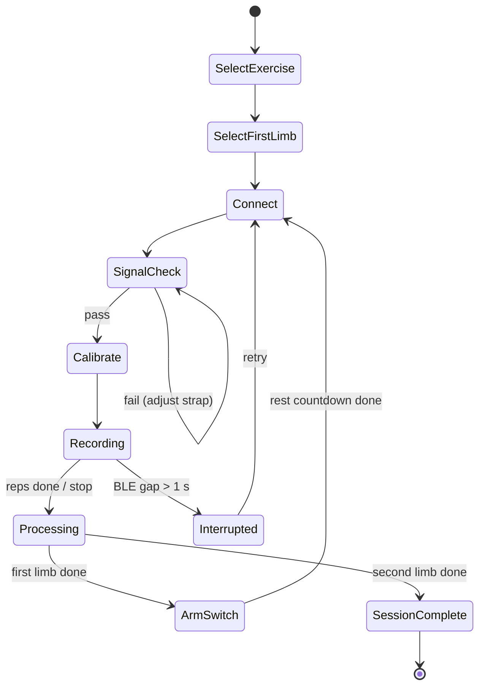

# System & Android App Design Document — Upper Limb Rehabilitation Tracker (GETMS)

**Version:** 2.0 · **Status:** Draft for team review · **Course:** COEN 390

---

## 0. Summary

A single wearable unit (ESP32 + MPU-6050 IMU + 2-channel EMG) is worn on the upper arm while a
patient performs a prescribed exercise (MVP: arm raise / shoulder flexion). Each session records the
**unaffected** and **affected** arm one after the other with the same device. Data streams over BLE
to a **native Android app (Kotlin + Jetpack Compose)**, which performs all signal processing and
feature extraction on-device, stores results in Firebase, and presents:

- a **patient view** (simple, motivational progress), and
- a **clinician dashboard** (drill-down: Patient → Exercise → Session → Metrics → Raw signals).

Out of scope: 3D visualization, multiple simultaneous devices, Cloud Functions, real patient data.

---

## 1. Requirements

### 1.1 Functional requirements

| ID | Requirement |
|---|---|
| FR-1 | Users sign in with Firebase Auth; role (patient/clinician) determines the home screen. |
| FR-2 | A patient links to a clinician using an invite code. |
| FR-3 | The app discovers, connects to and streams from one sensor unit over BLE. |
| FR-4 | The app checks signal quality before each recording. |
| FR-5 | The app calibrates each limb (EMG rest, EMG MVC, IMU neutral pose) before recording. |
| FR-6 | The app shows a live rep counter and live joint-angle trace during recording. |
| FR-7 | The app guides the arm switch with a fixed rest period and recalibration. |
| FR-8 | The app proposes the opposite first limb from the previous session; overriding requires a reason. |
| FR-9 | The app computes all metrics in §8 per recording and asymmetry per session. |
| FR-10 | Raw traces are saved locally and uploaded to Cloud Storage with retry. |
| FR-11 | Patient view shows streak, personal bests, ROM and asymmetry trends. |
| FR-12 | Clinician dashboard supports the full drill-down including raw signal viewing. |
| FR-13 | Users can only read data they are authorized to see (§11). |

### 1.2 Non-functional requirements

| ID | Requirement | Verified by |
|---|---|---|
| NFR-1 | Live rep counter updates ≤ 300 ms after rep peak | 9.8 |
| NFR-2 | BLE packet loss ≤ 1 % over a 2-min recording at 2 m | 9.7 |
| NFR-3 | End-of-recording processing ≤ 3 s on reference phone (mid-range, Android 12+) | 9.8 |
| NFR-4 | ROM error ≤ 5° RMS vs goniometer | 9.6 |
| NFR-5 | Reconnect after arm switch ≤ 10 s | 9.7 |
| NFR-6 | If battery-powered: ≥ 2 h continuous streaming | 9.8 |
| NFR-7 | No data loss when offline; upload completes when connectivity returns | 7.11 |
| NFR-8 | Cross-user reads denied (verified in Firebase Emulator tests) | 9.2, 9.3 |

---

## 2. System Architecture

```text
 Patient ─► EMG (2 ch) + IMU ─► ESP32 firmware ─► BLE ─► Android app ─► Firebase
                               (sample, band-pass,        (envelope, angle,      (Auth, Firestore,
                                fusion, timestamp)         reps, metrics, UI)     Cloud Storage)
```

### 2.1 Where each stage lives (decided)

| Stage | Location | Rationale |
|---|---|---|
| Sampling, EMG band-pass/notch, IMU fusion, timestamps | Firmware | Deterministic timing; fusion needs raw gyro at full rate |
| EMG envelope, %MVC, joint angle, live rep counting | App (real-time) | Needed for live feedback |
| Full feature extraction (SPARC, MDF, CCI…) and asymmetry | App (end of recording) | Runs once per recording; avoids Cloud Functions (Blaze plan) |
| Structured data | Firestore | Queryable metrics |
| Raw traces | Cloud Storage | Too large for Firestore |

Raw (band-passed) EMG is streamed rather than the envelope because fatigue (median frequency, §8)
requires the frequency content that an RMS envelope discards.

---

## 3. Hardware

### 3.1 Components

| Part | Source | Notes |
|---|---|---|
| ESP-32S dev board | Lab | Dual-core, FreeRTOS |
| MPU-6050 (6-DOF) | Lab | I2C @ 400 kHz |
| EMG sensor, 2 channels | Purchased | Ch A = anterior deltoid (agonist), Ch B = posterior deltoid (antagonist) |
| Gel electrodes + elastic strap | Purchased | Quick-swap design (§3.4) |
| Power | TBD IEEE???? (§3.3) | USB-tethered or LiPo + TP4056 |

### 3.2 Wiring rules
- EMG outputs go to **ADC1** pins only (ADC2 is unusable while the radio is active).
- Add analog conditioning (RC low-pass, or rely on the EMG board's onboard amplifier/filter) before the ADC;
  the ESP32 ADC is noisy and non-linear at low amplitudes.
- Pin map and wiring diagram are kept in `hardware/`.

### 3.3 Power
Default for the course demo: **USB-tethered** to a power bank. Battery (LiPo + TP4056) is optional; if used,
battery level is exposed via the standard BLE Battery Service and must meet NFR-6.

### 3.4 Mechanical
- Enclosure on the lateral upper arm, IMU x-axis aligned with the humerus (marked on the enclosure).
- Electrode landmarks documented with photos so placement is repeatable after every arm switch.
- Target: strap moved arm-to-arm by one person in ≤ 60 s.

---

## 4. Firmware (ESP32, Arduino core on ESP-IDF FreeRTOS)

| Task | Priority | Rate | Responsibility |
|---|---|---|---|
| `sampleTask` | Highest | EMG 1000 Hz (hw timer), IMU 100 Hz | Read ADC + I2C, push to queues |
| `dspTask` | High | — | EMG: 20–450 Hz band-pass + 60 Hz notch (biquads). IMU: gyro-bias removal + Madgwick 6-DOF → quaternion |
| `bleTask` | Normal | EMG 50 pkt/s, IMU 20 pkt/s | Pack and notify (§5), handle control commands |

- IMU ranges: accel ±4 g, gyro ±500 °/s. Gyro bias estimated at boot while stationary.
- Every packet carries a sequence number and a device timestamp (µs since START).
- States: `IDLE` (advertising) → `STREAMING` (after START) → `IDLE` (after STOP / disconnect).
- No calibration logic in firmware; calibration is computed in the app from streamed data.

---

## 5. BLE Interface Specification

### 5.1 Service and characteristics

| Name | UUID | Props | Payload |
|---|---|---|---|
| GETMS Service | `6e400000-0000-4000-8000-00805f9b34fb`* | — | — |
| EMG Data | `6e400001-…` | Notify | §5.3 |
| IMU Data | `6e400002-…` | Notify | §5.3 |
| Status | `6e400003-…` | Read, Notify | state u8, error flags u8, fw version u16 |
| Control | `6e400004-…` | Write | u8 command: 0x01 START, 0x02 STOP |
| Battery (optional) | `0x180F` / `0x2A19` | Read, Notify | % |

\* Final 128-bit UUIDs are generated once and kept in a shared constants file used by firmware and app.

### 5.2 Link parameters
- App requests MTU 247 and high connection priority; connection interval ≤ 30 ms.
- Device advertises as `GETMS-XXXX` (last 4 hex of MAC) with the service UUID.

### 5.3 Packet layout (little-endian)

**EMG packet (86 B, 50/s):**
`seq u16 | t0_us u32 | 20 × (chA i16, chB i16)`

**IMU packet (46 B, 20/s):**
`seq u16 | t0_us u32 | 5 × (qw, qx, qy, qz as i16, scale 2^14)`

Sample *i* timestamp = `t0_us + i × period`. Throughput ≈ 5.2 kB/s, well within BLE 4.2 limits.
The app counts sequence gaps to measure packet loss (NFR-2).

---

## 6. Android App

### 6.1 Platform
- Kotlin, Jetpack Compose, single-activity, **minSdk 26, targetSdk 35**.
- Libraries: Kable (BLE), Vico (charts), Firebase BoM (Auth, Firestore, Storage), Hilt (DI),
  Navigation Compose, DataStore (settings), WorkManager (uploads), JTransforms (FFT).
- Tests: JUnit, Turbine (Flows), Compose UI tests, Firebase Emulator Suite.

### 6.2 Architecture (MVVM + repositories)

```text
app/
├── ui/            Compose screens + ViewModels (StateFlow<UiState>)
├── session/       SessionStateMachine, RecordingService (foreground service)
├── ble/           SensorClient (Kable), PacketParser, ConnectionMonitor
├── processing/
│   ├── dsp/       filters, envelope, differentiation, FFT helpers
│   ├── realtime/  live angle + rep counter
│   └── features/  per-rep + per-recording metrics, asymmetry
├── data/          AuthRepo, SessionRepo, RecordingRepo, TraceStore (local), UploadWorker
└── di/            Hilt modules
```

Threading: BLE collection on `Dispatchers.IO`; DSP and feature extraction on `Dispatchers.Default`;
UI reads only `StateFlow`s from ViewModels.

### 6.3 Session state machine



### 6.4 Screens

| Screen | Content |
|---|---|
| Sign in / Register | Email + password; patient enters clinician invite code |
| Device | Scan list (name, RSSI), connect, status (battery, fw) |
| Exercise select | Exercises from Firestore with prescribed reps |
| First-limb select | Proposed limb (opposite of last session); override needs a reason |
| Signal check | Pass/fail per channel: rest noise, saturation, IMU stationary |
| Calibration | 5 s rest → 3 × 3 s MVC → 3 s neutral pose, with progress UI |
| Live session | Rep counter `7 / 10`, live angle trace, stop button |
| Arm switch | Instructions + photo of electrode landmarks, 60 s rest countdown |
| Session summary | Per-limb metrics + asymmetry |
| Patient home | Streak, personal bests, ROM + asymmetry trend charts |
| Clinician home | Patient list → Exercise → Session → Metrics → Raw signals |
| Settings | Forget device, rest duration (clinician), sign out, debug logging |

Every screen defines loading, empty and error states.

### 6.5 Android platform concerns
- **Permissions:** `BLUETOOTH_SCAN` (`neverForLocation`), `BLUETOOTH_CONNECT`, `POST_NOTIFICATIONS`;
  `ACCESS_FINE_LOCATION` only on API < 31. Rationale screen before request; graceful denial handling.
- **Foreground service:** recording runs in `RecordingService` (`foregroundServiceType="connectedDevice"`)
  so it survives screen-off / app switch.
- **Offline:** Firestore offline persistence enabled. Raw traces written to internal storage first,
  then uploaded by WorkManager with exponential backoff; `rawTraceStatus` goes `pending → uploaded`.

---

## 7. Signal Processing (app)

### 7.1 IMU
1. Relative orientation: `q_rel = q0⁻¹ ⊗ q`, where `q0` is captured during the neutral-pose calibration.
2. Shoulder flexion angle = rotation of the humerus axis in the sagittal plane (degrees).
3. Low-pass: 4th-order Butterworth, 6 Hz — causal for live view, zero-phase (forward-backward) for features.
4. Central differences → angular velocity (°/s) → angular acceleration (°/s²).

### 7.2 EMG
1. Rectify band-passed signal; RMS envelope, 100 ms window.
2. Normalize: `%MVC = envelope / MVC_peak × 100` (per channel, per recording).
3. Onset: envelope > `μ_rest + 3σ_rest` sustained ≥ 50 ms.

### 7.3 Repetition segmentation
Peaks on the filtered angle with prominence ≥ `exercise.minPeakProminenceDeg` (arm raise: 20°) and
spacing ≥ `exercise.minRepIntervalS` (arm raise: 1.0 s). A rep spans from the preceding to the following
local minimum. EMG onset refines the rep start.

### 7.4 Signal-quality check (before calibration)
Pass if, over 3 s at rest: EMG RMS below threshold per channel, no ADC saturation, IMU angular rate < 5 °/s.

---

## 8. Metrics

### 8.1 Per recording (aggregated as mean across reps unless stated)

| Metric | Definition | Unit |
|---|---|---|
| ROM | max − min angle within rep | ° |
| Peak speed | max \|angular velocity\| in rep | °/s |
| Peak acceleration | max \|angular acceleration\| in rep | °/s² |
| Smoothness | SPARC on speed profile; negative, closer to 0 = smoother | — |
| Rep performance | reps completed / prescribed; time to complete | count, s |
| Variability | CV = SD / mean × 100 of ROM and peak speed across reps | % |
| Activation level | mean %MVC of Ch A during activation window | %MVC |
| Activation timing | EMG onset − movement onset | ms |
| Fatigue | median frequency (Welch, 256-pt Hann) of Ch A per rep; report slope across reps | Hz, Hz/rep |
| Coordination | CCI = 2·Σmin(A,B) / Σ(A+B) × 100 on %MVC envelopes | % |

Per-rep values are stored (§10) so clinicians can see *why* an aggregate changed.

### 8.2 Asymmetry (per session)
`AI = |X_aff − X_unaff| / ((|X_aff| + |X_unaff|) / 2) × 100 %`

Absolute values handle negative metrics (SPARC). If both values are 0, AI = 0. **Lower is better**;
all charts label it “Asymmetry (%) — lower is better”.

### 8.3 Illustrative trend

| Metric | Session 1 | Session 10 |
|---|---:|---:|
| ROM (affected) | 62° | 81° |
| Peak speed (affected) | 85 °/s | 120 °/s |
| SPARC (affected) | −2.4 | −1.7 |
| Reps | 8/10 | 10/10 |
| Activation (affected) | 31 %MVC | 39 %MVC |
| ROM asymmetry | 30 % | 8 % |

---

## 9. Dashboards

- **Patient:** streak, personal bests, ROM and ROM-asymmetry trends, last-session summary.
- **Clinician:** patient list → exercises → chronological sessions → session metrics (per limb + AI,
  side-by-side bars) → raw signal viewer (downloaded on demand, zoomable, rep boundaries overlaid).
- Charts: Vico, driven by the queries in §10.5.

---

## 10. Data Model (Firestore + Cloud Storage)

`userId` and `clinicianId` are denormalized onto every patient-owned document so security rules
need no joins.

### 10.1 `users/{uid}`
```json
{ "role": "patient", "name": "P-024", "affectedSide": "left",
  "clinicianId": "c1", "inviteCode": "K7Q2", "createdAt": "ts" }
```
Role can only be set to `clinician` from the Firebase console.

### 10.2 `invites/{code}`
```json
{ "clinicianId": "c1" }
```

### 10.3 `exercises/{exerciseId}`
```json
{ "name": "Arm Raise", "prescribedReps": 10,
  "minPeakProminenceDeg": 20, "minRepIntervalS": 1.0, "restPeriodS": 60 }
```

### 10.4 `sessions/{sessionId}`
```json
{ "userId": "123", "clinicianId": "c1", "exerciseId": "ex_armraise", "date": "ts",
  "firstLimbTested": "unaffected", "orderOverrideReason": null, "restPeriodS": 60,
  "status": "complete",
  "asymmetry": { "rom": 8.3, "peakSpeed": 7.9, "sparc": 12.1, "activation": 5.0 } }
```

### 10.5 `recordings/{recordingId}`
```json
{ "sessionId": "abc123", "userId": "123", "clinicianId": "c1",
  "limb": "unaffected", "side": "right", "startTime": "ts", "endTime": "ts",
  "appVersion": "1.0.0", "firmwareVersion": "0.3",
  "calibration": { "restMean": [120, 98], "restSd": [8, 6], "mvcPeak": [3400, 2900],
                   "q0": [1, 0, 0, 0] },
  "rawTraceRef": "raw/123/abc123/rec_1.bin", "rawTraceStatus": "uploaded",
  "metrics": { "rom": 88, "peakSpeed": 124, "peakAccel": 610, "sparc": -1.8,
               "repsCompleted": 10, "timeToCompleteS": 31.2, "cvRom": 7,
               "activation": 41, "onsetLatencyMs": 85, "mdfSlope": -0.6, "cci": 22 } }
```
Sub-collection `recordings/{id}/reps/{n}` holds per-rep metrics.

**Trend query:** `sessions where userId == X and exerciseId == Y order by date`
(composite index), then `recordings where sessionId in [...]`.

### 10.6 Raw traces
Path `raw/{uid}/{sessionId}/{recordingId}.bin`: one JSON header line (rates, scales, versions),
followed by the concatenated EMG and IMU packets exactly as received (§5.3).

### 10.7 Security rules (sketch)
```text
function isSelf(uid)       { return request.auth.uid == uid; }
function isClinicianOf(d)  { return request.auth.uid == d.clinicianId; }

match /users/{uid} {
  allow read:   if isSelf(uid) || isClinicianOf(resource.data);
  allow create: if isSelf(uid) && request.resource.data.role == "patient";
  allow update: if isSelf(uid) && request.resource.data.role == resource.data.role
                && request.resource.data.clinicianId ==
                   get(/databases/$(database)/documents/invites/$(request.resource.data.inviteCode)).data.clinicianId;
}
match /invites/{code}       { allow get: if request.auth != null; allow list: if false; }
match /sessions/{id}        { allow read: if isSelf(resource.data.userId) || isClinicianOf(resource.data);
                              allow write: if isSelf(request.resource.data.userId); }
match /recordings/{id}/{d=**} { /* same as sessions */ }
```
Storage rules mirror this using the `{uid}` path segment plus a Firestore lookup for clinicians.

---

## 11. Security & Privacy (decided)
- Course prototype: **no real patient data**. Test subjects are team members / volunteers with consent,
  identified by pseudonyms (e.g. `P-024`).
- Firebase default encryption at rest and TLS in transit.
- All data deleted at the end of the term.
- Rules verified with Firebase Emulator tests (NFR-8).

---

## 12. Testing & Validation

### 12.1 Protocol controls
- First limb alternates each session (FR-8); overrides are logged with a reason.
- Fixed rest period between recordings (`exercise.restPeriodS`, default 60 s).
- Electrode placement follows the documented landmarks.

### 12.2 Test coverage

| Level | What | Target |
|---|---|---|
| Unit | Filters, envelope, reps, every §8 metric, AI | Synthetic signals with known answers |
| Integration | BLE stream + parser, arm-switch reconnect, upload retry | NFR-2, NFR-5, NFR-7 |
| Security | Rules in Emulator Suite | NFR-8 |
| UI | Drill-down navigation, session flow, permission denial | Compose UI tests |
| Validation | ROM vs goniometer (n ≥ 30 reps); rep detection on ≥ 10 labelled recordings | NFR-4; ≥ 95 % rep accuracy |
| Performance | Live latency, processing time, battery | NFR-1, NFR-3, NFR-6 |

---

## 13. Roadmap (GitHub milestones)

| Milestone | Scope (epics) |
|---|---|
| M1 Foundations | Epic 1 hardware, 10.1–10.3 project setup |
| M2 Firmware & BLE | Epic 2, Epic 3 |
| M3 Session Flow | Epic 4 |
| M4 Processing & Metrics | Epic 5, Epic 6 |
| M5 Data Platform | Epic 7 |
| M6 Dashboards | Epic 8 |
| M7 Validation & Docs | Epic 9, 10.4–10.6 |

---

## 14. Open Questions
1. Battery vs USB-tethered for the final demo (default: USB).
2. Additional exercises beyond arm raise after MVP (the pipeline is parameterized via `exercises`).
3. Validation reference: goniometer only, or also video (e.g. phone video + manual annotation)?

---

## 15. Deliverables
- **Firmware:** ESP32 FreeRTOS firmware (§4) implementing the BLE spec (§5).
- **Android app:** §6–§9.
- **Backend:** Firestore schema, indexes, security rules, Storage rules (§10).
- **Docs:** this document, BLE spec (§5), algorithm reference (§7–§8), validation report (§12).
