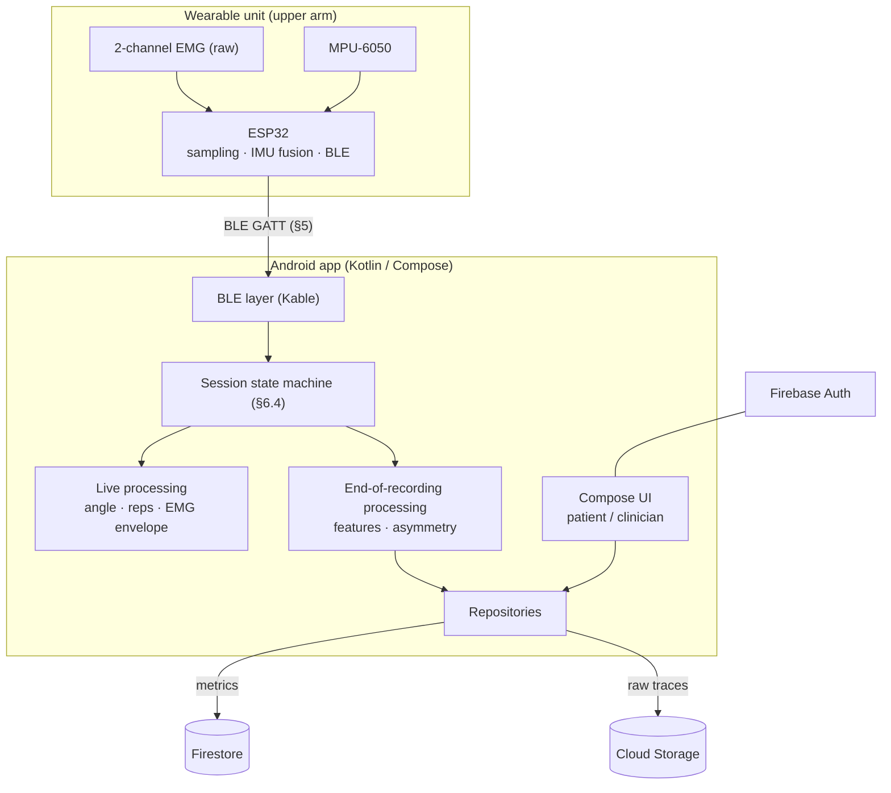

# GETMS — Upper-Limb Rehabilitation Tracker
## System and Android App Design Document — v2

**Course:** COEN 390 · **Status:** Draft v2 (replaces v1) · **Tracking:** GitHub epics 1–9, milestones M1–M9

### Changes from v1
- Raw EMG is streamed so fatigue (median frequency) can be computed; EMG filtering/envelope moved to the phone.
- Two EMG channels (anterior and posterior deltoid) made explicit.
- Units fixed: angular speed in deg/s, activation in %MVC, SPARC is negative.
- Asymmetry index (A) and patient-facing symmetry score (S) defined; charts state which is shown.
- Data model: `affectedSide`, `userId`, `clinicianId` added; calibration embedded in recordings; asymmetry embedded in sessions; per-rep data stored.
- New: requirements with IDs (§1), BLE interface spec (§5), Android architecture, permissions and state machine (§6), signal-quality check (§7.5), security rules (§10.3), decisions log (§14).

---

## 0. Summary

One wearable unit with two EMG channels and a 6-axis IMU records a patient doing a prescribed exercise (MVP: arm raise). Because there is only one unit, each session contains **two recordings made one after the other**: one on the unaffected arm and one on the affected arm. Data streams over Bluetooth Low Energy (BLE) to a **native Android app (Kotlin, Jetpack Compose — required by the course brief)**. The app gives live feedback (rep counter, signal traces), computes clinical metrics at the end of each recording, pairs the two recordings, and computes bilateral asymmetry. Results sync to Firebase and are shown in two role-based views in the same app: a simple, motivating patient view and a drill-down clinician dashboard.

This covers the brief's three parts: sensors (ESP32 wearable), an Android app, and data analytics.

**In scope (MVP):** one exercise (arm raise), one wearable, patient and clinician roles, testing with healthy volunteers.
**Out of scope:** 3D arm visualisation, two simultaneous devices, use with real patients, iOS/web clients.

---

## 1. Requirements

### 1.1 Functional

| ID | Requirement |
|---|---|
| FR-1 | Users sign up/in with email and password; the app routes by role (patient / clinician). |
| FR-2 | A patient links to a clinician with a clinician-issued invite code. |
| FR-3 | The app discovers and connects to the wearable and shows its status and battery. |
| FR-4 | The user selects an exercise and the first arm; the app suggests alternating the first arm. |
| FR-5 | The app checks signal quality before calibration. |
| FR-6 | The app calibrates each arm before each recording (neutral pose, EMG rest, MVC). |
| FR-7 | The app guides the recording with a countdown, live rep counter and live traces. |
| FR-8 | The app guides the arm switch with a rest timer and re-calibration. |
| FR-9 | The app computes all per-recording metrics (§8.1) on the phone. |
| FR-10 | The app pairs both recordings of a session and computes asymmetry (§8.2). |
| FR-11 | Metrics and per-rep data are stored in Firestore, raw traces in Cloud Storage; works offline and syncs later. |
| FR-12 | Patients see progress: last session, streak, personal bests, ROM and symmetry trends. |
| FR-13 | Clinicians drill down Patient → Exercise → Session → Metrics and view metric trends. |
| FR-14 | Clinicians view raw EMG/IMU signals with rep boundaries. |
| FR-15 | Patients see only their data; clinicians see only their linked patients (enforced server-side). |
| FR-16 | Settings: forget device, rest-timer length, affected side, sign out, versions. |
| FR-17 | Recording continues when the screen turns off. |

### 1.2 Non-functional

| ID | Requirement | Verified by |
|---|---|---|
| NFR-1 | Live rep counter updates ≤ 250 ms after each rep peak | 9.8 |
| NFR-2 | End-of-recording processing ≤ 3 s for a 60 s recording on the reference phone | 9.8 |
| NFR-3 | BLE packet loss ≤ 1% at 2 m over 10 min | 9.7 |
| NFR-4 | Reconnect after a drop or arm switch ≤ 10 s | 9.7 |
| NFR-5 | Wearable runs ≥ 2 h while streaming | 1.5, 9.8 |
| NFR-6 | ROM mean absolute error ≤ 5° vs reference; rep detection precision and recall ≥ 95% | 9.4, 9.6 |
| NFR-7 | A 20-session trend chart loads in ≤ 2 s on Wi-Fi | 7.9 |
| NFR-8 | No crash or ANR on BLE loss, permission denial or no network | 3.5, 9.7 |
| NFR-9 | No mains connection while electrodes are on a person | 1.5 |
| NFR-10 | Data isolation enforced by security rules and tested in the emulator | 9.2, 9.3 |

---

## 2. System Architecture

### 2.1 Overview



### 2.2 Session protocol (one device, two recordings)

1. Choose the exercise. The app suggests which arm goes first (opposite of last session, §12.1).
2. Strap the unit on that arm, run the signal check (§7.5), calibrate (§7.1).
3. Record the exercise → **recording 1**.
4. Timed rest (default 60 s). Move the unit to the other arm with fresh electrodes.
5. Signal check, calibrate, record → **recording 2**.
6. The app pairs both recordings and computes asymmetry (§8.2); the session is complete.

### 2.3 Where each stage runs (decided)

| Stage | Where | Why |
|---|---|---|
| Sampling, IMU fusion | ESP32 | Fixed-rate timing; fusion needs full-rate gyro |
| EMG filtering and envelope | Android, live | Raw EMG is needed on the phone for fatigue anyway (D2) |
| Rep detection, live feedback | Android, live | Must appear on screen in real time |
| Feature extraction, asymmetry | Android, end of recording | Fast enough on the phone; no Cloud Functions, so no paid Firebase plan (D1) |
| Storage and trends | Firestore + Cloud Storage | Metrics as documents; raw traces as files |
| Dashboards | Android, role-gated | One codebase |

---

## 3. Hardware

### 3.1 Components

| Part | Qty | Source | Notes |
|---|---|---|---|
| ESP-32S dev board (dual-core ESP32) | 1 | Lab | FreeRTOS, BLE |
| MPU-6050 breakout (accel + gyro) | 1 | Lab | I2C, no magnetometer |
| EMG sensor with **raw** analog output (e.g. MyoWare 2.0) | 2 | Purchased | ch1 anterior deltoid, ch2 posterior deltoid |
| Disposable gel electrodes | per recording | Purchased | Fresh set for each arm |
| Small USB power bank | 1 | Purchased | MVP power (D11) |
| (Stretch) 1S LiPo + TP4056 with protection + low-dropout 3.3 V regulator | 1 | Purchased | Replaces power bank |

### 3.2 Pin map

| Signal | ESP32 pin | Notes |
|---|---|---|
| EMG ch1 RAW | GPIO36 (ADC1) | 11 dB attenuation |
| EMG ch2 RAW | GPIO39 (ADC1) | 11 dB attenuation |
| MPU-6050 SDA / SCL | GPIO21 / GPIO22 | 400 kHz I2C |
| Battery sense (LiPo build only) | GPIO35 via 100k/100k divider | |
| Wake button | GPIO27 | To GND, internal pull-up |
| Status LED | GPIO2 | On-board |

Use ADC1 pins only; ADC2 is shared with the Wi-Fi driver. The ESP32 ADC is noisy at low amplitudes: keep EMG leads short, twisted and away from the antenna. Gain non-linearity matters little because EMG is normalised to %MVC and fatigue is frequency-based.

### 3.3 Power and electrical safety

- **MVP:** a small USB power bank on the strap. Check that it does not switch off at low current draw.
- **Stretch:** LiPo + TP4056 + low-dropout 3.3 V regulator into the 3V3 pin. Do not feed a LiPo through the dev board's AMS1117; its dropout is too high at LiPo voltages.
- **Safety rule (NFR-9):** electrodes are attached to a person, so **never record while the board's USB is connected to a mains-powered computer or wall charger**. Flash and debug with electrodes disconnected.

### 3.4 Mechanical

- Unit on the lateral upper arm; IMU x-axis along the humerus pointing to the elbow (marked on the enclosure).
- Electrodes: ch1 anterior deltoid, ch2 posterior deltoid, reference electrode on a bony landmark per the sensor datasheet.
- Fresh electrodes for each arm; placement documented with photos; arm swap ≤ 60 s by one person.
- A loose strap causes motion artefacts, the most common EMG failure. The strap must be snug and the IMU rigidly fixed.

---

## 4. Firmware

### 4.1 Framework and tasks

Arduino-ESP32 core (FreeRTOS from ESP-IDF), built with PlatformIO; NimBLE-Arduino for BLE (less RAM than Bluedroid).

| Task | Core | Priority | Trigger | Job |
|---|---|---|---|---|
| `sample_emg` | 1 | Highest | 1 kHz timer | Read both EMG channels, push frames to `emgQueue` |
| `imu_fusion` | 1 | High | 100 Hz timer | Read MPU-6050, Madgwick update, push to `imuQueue` |
| `ble_tx` | 0 | Medium | Queue data | Pack §5.2 packets and notify |
| `control` | 0 | Low | Writes / 1 Hz | Handle §5.3 commands, update Status |

Queues hold ≥ 200 ms of data; overflows are counted and reported in Status.

### 4.2 Sampling

- **EMG:** 2 channels × 1000 Hz, 12-bit, sent as int16 (`adc − 2048`). No digital filtering on the device (D2).
- **IMU:** 100 Hz, ±4 g, ±500 dps, DLPF 44 Hz. Gyro bias estimated from 2 s of stillness at start-up.

### 4.3 Sensor fusion

Madgwick 6-DOF filter (β ≈ 0.1, tuned on the bench) outputs a unit quaternion. Without a magnetometer, yaw drifts; the app only uses the elevation angle, which does not depend on yaw (§7.2). `RESET_ORIENTATION` re-initialises the filter from the accelerometer.

### 4.4 Timestamping

`esp_timer_get_time()` (µs). Each packet carries a u32 timestamp of its first sample (wraps every ~71 min; the app unwraps) and a u16 sequence number per characteristic. EMG and IMU share the same clock, so the app can align them.

### 4.5 Power management

When not streaming: sensors idle, advertising every 500 ms. After 10 min idle: deep sleep, wake with the button. Battery % reported in Status (255 = unknown, e.g. with a power bank).

---

## 5. BLE Interface

### 5.1 GATT service

Generate one 128-bit base UUID with `uuidgen` and record it in `docs/ble-spec.md`; below, `…000N` means the base UUID with the last group ending in `000N`.

| Item | UUID | Properties | Content |
|---|---|---|---|
| GETMS service | `…0001` | — | — |
| EMG data | `…0002` | Notify | §5.2 |
| IMU data | `…0003` | Notify | §5.2 |
| Status | `…0004` | Read, Notify | §5.2 |
| Control | `…0005` | Write | §5.3 |

Advertised name: `GETMS-XXXX` (last 4 hex digits of the MAC).

### 5.2 Packet formats (little-endian)

**EMG packet (207 B, 20 per second)**

| Offset | Size | Field |
|---|---|---|
| 0 | 2 | `seq` (u16) |
| 2 | 4 | `t0_us` (u32), time of first frame |
| 6 | 1 | `n` frames (50) |
| 7 | 4·n | Frames: ch1 int16, ch2 int16, 1 ms apart |

**IMU packet (147 B, 10 per second)**

| Offset | Size | Field |
|---|---|---|
| 0 | 2 | `seq` (u16) |
| 2 | 4 | `t0_us` (u32) |
| 6 | 1 | `n` frames (10) |
| 7 | 14·n | Frames: qw, qx, qy, qz int16 Q14 (÷16384); gx, gy, gz int16 in 0.1 deg/s; 10 ms apart |

**Status (8 B)**

| Offset | Size | Field |
|---|---|---|
| 0 | 1 | `protoMajor` |
| 1 | 1 | `protoMinor` |
| 2 | 1 | `state` (0 idle, 1 streaming, 2 error) |
| 3 | 1 | `battery` (0–100, 255 unknown) |
| 4 | 1 | `flags` (bit0 IMU error, bit1 EMG clipping, bit2 queue overflow) |
| 5 | 1 | reserved |
| 6 | 2 | `droppedFrames` (u16) |

### 5.3 Control commands (write, 1-byte opcode)

| Opcode | Command |
|---|---|
| 0x01 | `START_STREAM` |
| 0x02 | `STOP_STREAM` |
| 0x03 | `RESET_ORIENTATION` |
| 0x04 | `SLEEP` |

Calibration is computed in the app from streamed data (D3), so no calibration command is needed.

### 5.4 Throughput budget

EMG ≈ 20 × 207 B = 4.1 KB/s; IMU ≈ 10 × 147 B = 1.5 KB/s; total ≈ 5.6 KB/s (≈ 45 kbit/s). This requires **MTU 247** (requested by the app; the default MTU of 23 cannot carry these packets). The app requests high connection priority while recording and balanced otherwise.

### 5.5 Connection management

- The app remembers the last device; scans are filtered by service UUID and stop after 15 s.
- Firmware stops streaming on disconnect and only resumes on `START_STREAM`.
- Auto-reconnect with backoff 0.5, 1, 2, 4 s — 10 s total (NFR-4).
- Arm switch: the app sends `STOP_STREAM` and keeps the link open.
- A different `protoMajor` is refused with an "update firmware/app" message.

---

## 6. Android App

### 6.1 Platform and libraries

| Item | Choice |
|---|---|
| Language / UI | Kotlin 2.x, Jetpack Compose (Material 3) |
| SDK | minSdk 26, targetSdk 35 |
| BLE | Kable (coroutines / Flow) |
| Charts | Vico |
| Backend | Firebase BoM: Auth, Firestore, Storage |
| DI / navigation | Hilt, Navigation Compose |
| Background work | Foreground service (recording), WorkManager (uploads) |
| Tests | JUnit, Turbine, Compose UI tests, Firebase Emulator Suite |

### 6.2 Architecture and modules

MVVM with unidirectional data flow: Compose screens observe ViewModel `StateFlow`s; ViewModels call the `SessionController` and repositories.

```text
:app         Compose screens, ViewModels, navigation, Hilt modules, RecordingService, SessionController
:ble         SensorClient (Kable), PacketParser, CommandWriter, BleSpec constants
:processing  Pure Kotlin/JVM: filters, elevation angle, EMG envelope, reps, features, asymmetry
:data        Repositories (User, Exercise, Session, Recording, RawTrace), Firebase and local storage
```

- `:processing` has no Android or Firebase dependency, so it is unit-tested quickly on the JVM.
- `:ble` and `:data` do not depend on each other; `:app` wires them together.
- `SessionController` is owned by `RecordingService` and orchestrates BLE → processing → data.

### 6.3 Permissions and foreground service

| Permission | API | Why |
|---|---|---|
| `BLUETOOTH_SCAN` (`neverForLocation`) | 31+ | Scan |
| `BLUETOOTH_CONNECT` | 31+ | Connect |
| `BLUETOOTH`, `BLUETOOTH_ADMIN` (maxSdkVersion 30), `ACCESS_FINE_LOCATION` | ≤ 30 | Scan on older Android |
| `POST_NOTIFICATIONS` | 33+ | Recording notification |
| `FOREGROUND_SERVICE`, `FOREGROUND_SERVICE_CONNECTED_DEVICE` | 34+ for the second | Recording service |

Recording runs in a foreground service of type `connectedDevice` with an ongoing notification (e.g. "Recording – right arm – rep 4/10"). A rationale screen is sh# GETMS — Upper-Limb Rehabilitation Tracker
## System and Android App Design Document — v2

**Course:** COEN 390 · **Status:** Draft v2 (replaces v1) · **Tracking:** GitHub epics 1–9, milestones M1–M9

### Changes from v1
- Raw EMG is streamed so fatigue (median frequency) can be computed; EMG filtering/envelope moved to the phone.
- Two EMG channels (anterior and posterior deltoid) made explicit.
- Units fixed: angular speed in deg/s, activation in %MVC, SPARC is negative.
- Asymmetry index (A) and patient-facing symmetry score (S) defined; charts state which is shown.
- Data model: `affectedSide`, `userId`, `clinicianId` added; calibration embedded in recordings; asymmetry embedded in sessions; per-rep data stored.
- New: requirements with IDs (§1), BLE interface spec (§5), Android architecture, permissions and state machine (§6), signal-quality check (§7.5), security rules (§10.3), decisions log (§14).

---

## 0. Summary

One wearable unit with two EMG channels and a 6-axis IMU records a patient doing a prescribed exercise (MVP: arm raise). Because there is only one unit, each session contains **two recordings made one after the other**: one on the unaffected arm and one on the affected arm. Data streams over Bluetooth Low Energy (BLE) to a **native Android app (Kotlin, Jetpack Compose — required by the course brief)**. The app gives live feedback (rep counter, signal traces), computes clinical metrics at the end of each recording, pairs the two recordings, and computes bilateral asymmetry. Results sync to Firebase and are shown in two role-based views in the same app: a simple, motivating patient view and a drill-down clinician dashboard.

This covers the brief's three parts: sensors (ESP32 wearable), an Android app, and data analytics.

**In scope (MVP):** one exercise (arm raise), one wearable, patient and clinician roles, testing with healthy volunteers.
**Out of scope:** 3D arm visualisation, two simultaneous devices, use with real patients, iOS/web clients.

---

## 1. Requirements

### 1.1 Functional

| ID | Requirement |
|---|---|
| FR-1 | Users sign up/in with email and password; the app routes by role (patient / clinician). |
| FR-2 | A patient links to a clinician with a clinician-issued invite code. |
| FR-3 | The app discovers and connects to the wearable and shows its status and battery. |
| FR-4 | The user selects an exercise and the first arm; the app suggests alternating the first arm. |
| FR-5 | The app checks signal quality before calibration. |
| FR-6 | The app calibrates each arm before each recording (neutral pose, EMG rest, MVC). |
| FR-7 | The app guides the recording with a countdown, live rep counter and live traces. |
| FR-8 | The app guides the arm switch with a rest timer and re-calibration. |
| FR-9 | The app computes all per-recording metrics (§8.1) on the phone. |
| FR-10 | The app pairs both recordings of a session and computes asymmetry (§8.2). |
| FR-11 | Metrics and per-rep data are stored in Firestore, raw traces in Cloud Storage; works offline and syncs later. |
| FR-12 | Patients see progress: last session, streak, personal bests, ROM and symmetry trends. |
| FR-13 | Clinicians drill down Patient → Exercise → Session → Metrics and view metric trends. |
| FR-14 | Clinicians view raw EMG/IMU signals with rep boundaries. |
| FR-15 | Patients see only their data; clinicians see only their linked patients (enforced server-side). |
| FR-16 | Settings: forget device, rest-timer length, affected side, sign out, versions. |
| FR-17 | Recording continues when the screen turns off. |

### 1.2 Non-functional

| ID | Requirement | Verified by |
|---|---|---|
| NFR-1 | Live rep counter updates ≤ 250 ms after each rep peak | 9.8 |
| NFR-2 | End-of-recording processing ≤ 3 s for a 60 s recording on the reference phone | 9.8 |
| NFR-3 | BLE packet loss ≤ 1% at 2 m over 10 min | 9.7 |
| NFR-4 | Reconnect after a drop or arm switch ≤ 10 s | 9.7 |
| NFR-5 | Wearable runs ≥ 2 h while streaming | 1.5, 9.8 |
| NFR-6 | ROM mean absolute error ≤ 5° vs reference; rep detection precision and recall ≥ 95% | 9.4, 9.6 |
| NFR-7 | A 20-session trend chart loads in ≤ 2 s on Wi-Fi | 7.9 |
| NFR-8 | No crash or ANR on BLE loss, permission denial or no network | 3.5, 9.7 |
| NFR-9 | No mains connection while electrodes are on a person | 1.5 |
| NFR-10 | Data isolation enforced by security rules and tested in the emulator | 9.2, 9.3 |

---

## 2. System Architecture

### 2.1 Overview


### 2.2 Session protocol (one device, two recordings)

1. Choose the exercise. The app suggests which arm goes first (opposite of last session, §12.1).
2. Strap the unit on that arm, run the signal check (§7.5), calibrate (§7.1).
3. Record the exercise → **recording 1**.
4. Timed rest (default 60 s). Move the unit to the other arm with fresh electrodes.
5. Signal check, calibrate, record → **recording 2**.
6. The app pairs both recordings and computes asymmetry (§8.2); the session is complete.

### 2.3 Where each stage runs (decided)

| Stage | Where | Why |
|---|---|---|
| Sampling, IMU fusion | ESP32 | Fixed-rate timing; fusion needs full-rate gyro |
| EMG filtering and envelope | Android, live | Raw EMG is needed on the phone for fatigue anyway (D2) |
| Rep detection, live feedback | Android, live | Must appear on screen in real time |
| Feature extraction, asymmetry | Android, end of recording | Fast enough on the phone; no Cloud Functions, so no paid Firebase plan (D1) |
| Storage and trends | Firestore + Cloud Storage | Metrics as documents; raw traces as files |
| Dashboards | Android, role-gated | One codebase |

---

## 3. Hardware

### 3.1 Components

| Part | Qty | Source | Notes |
|---|---|---|---|
| ESP-32S dev board (dual-core ESP32) | 1 | Lab | FreeRTOS, BLE |
| MPU-6050 breakout (accel + gyro) | 1 | Lab | I2C, no magnetometer |
| EMG sensor with **raw** analog output (e.g. MyoWare 2.0) | 2 | Purchased | ch1 anterior deltoid, ch2 posterior deltoid |
| Disposable gel electrodes | per recording | Purchased | Fresh set for each arm |
| Small USB power bank | 1 | Purchased | MVP power (D11) |
| (Stretch) 1S LiPo + TP4056 with protection + low-dropout 3.3 V regulator | 1 | Purchased | Replaces power bank |

### 3.2 Pin map

| Signal | ESP32 pin | Notes |
|---|---|---|
| EMG ch1 RAW | GPIO36 (ADC1) | 11 dB attenuation |
| EMG ch2 RAW | GPIO39 (ADC1) | 11 dB attenuation |
| MPU-6050 SDA / SCL | GPIO21 / GPIO22 | 400 kHz I2C |
| Battery sense (LiPo build only) | GPIO35 via 100k/100k divider | |
| Wake button | GPIO27 | To GND, internal pull-up |
| Status LED | GPIO2 | On-board |

Use ADC1 pins only; ADC2 is shared with the Wi-Fi driver. The ESP32 ADC is noisy at low amplitudes: keep EMG leads short, twisted and away from the antenna. Gain non-linearity matters little because EMG is normalised to %MVC and fatigue is frequency-based.

### 3.3 Power and electrical safety

- **MVP:** a small USB power bank on the strap. Check that it does not switch off at low current draw.
- **Stretch:** LiPo + TP4056 + low-dropout 3.3 V regulator into the 3V3 pin. Do not feed a LiPo through the dev board's AMS1117; its dropout is too high at LiPo voltages.
- **Safety rule (NFR-9):** electrodes are attached to a person, so **never record while the board's USB is connected to a mains-powered computer or wall charger**. Flash and debug with electrodes disconnected.

### 3.4 Mechanical

- Unit on the lateral upper arm; IMU x-axis along the humerus pointing to the elbow (marked on the enclosure).
- Electrodes: ch1 anterior deltoid, ch2 posterior deltoid, reference electrode on a bony landmark per the sensor datasheet.
- Fresh electrodes for each arm; placement documented with photos; arm swap ≤ 60 s by one person.
- A loose strap causes motion artefacts, the most common EMG failure. The strap must be snug and the IMU rigidly fixed.

---

## 4. Firmware

### 4.1 Framework and tasks

Arduino-ESP32 core (FreeRTOS from ESP-IDF), built with PlatformIO; NimBLE-Arduino for BLE (less RAM than Bluedroid).

| Task | Core | Priority | Trigger | Job |
|---|---|---|---|---|
| `sample_emg` | 1 | Highest | 1 kHz timer | Read both EMG channels, push frames to `emgQueue` |
| `imu_fusion` | 1 | High | 100 Hz timer | Read MPU-6050, Madgwick update, push to `imuQueue` |
| `ble_tx` | 0 | Medium | Queue data | Pack §5.2 packets and notify |
| `control` | 0 | Low | Writes / 1 Hz | Handle §5.3 commands, update Status |

Queues hold ≥ 200 ms of data; overflows are counted and reported in Status.

### 4.2 Sampling

- **EMG:** 2 channels × 1000 Hz, 12-bit, sent as int16 (`adc − 2048`). No digital filtering on the device (D2).
- **IMU:** 100 Hz, ±4 g, ±500 dps, DLPF 44 Hz. Gyro bias estimated from 2 s of stillness at start-up.

### 4.3 Sensor fusion

Madgwick 6-DOF filter (β ≈ 0.1, tuned on the bench) outputs a unit quaternion. Without a magnetometer, yaw drifts; the app only uses the elevation angle, which does not depend on yaw (§7.2). `RESET_ORIENTATION` re-initialises the filter from the accelerometer.

### 4.4 Timestamping

`esp_timer_get_time()` (µs). Each packet carries a u32 timestamp of its first sample (wraps every ~71 min; the app unwraps) and a u16 sequence number per characteristic. EMG and IMU share the same clock, so the app can align them.

### 4.5 Power management

When not streaming: sensors idle, advertising every 500 ms. After 10 min idle: deep sleep, wake with the button. Battery % reported in Status (255 = unknown, e.g. with a power bank).

---

## 5. BLE Interface

### 5.1 GATT service

Generate one 128-bit base UUID with `uuidgen` and record it in `docs/ble-spec.md`; below, `…000N` means the base UUID with the last group ending in `000N`.

| Item | UUID | Properties | Content |
|---|---|---|---|
| GETMS service | `…0001` | — | — |
| EMG data | `…0002` | Notify | §5.2 |
| IMU data | `…0003` | Notify | §5.2 |
| Status | `…0004` | Read, Notify | §5.2 |
| Control | `…0005` | Write | §5.3 |

Advertised name: `GETMS-XXXX` (last 4 hex digits of the MAC).

### 5.2 Packet formats (little-endian)

**EMG packet (207 B, 20 per second)**

| Offset | Size | Field |
|---|---|---|
| 0 | 2 | `seq` (u16) |
| 2 | 4 | `t0_us` (u32), time of first frame |
| 6 | 1 | `n` frames (50) |
| 7 | 4·n | Frames: ch1 int16, ch2 int16, 1 ms apart |

**IMU packet (147 B, 10 per second)**

| Offset | Size | Field |
|---|---|---|
| 0 | 2 | `seq` (u16) |
| 2 | 4 | `t0_us` (u32) |
| 6 | 1 | `n` frames (10) |
| 7 | 14·n | Frames: qw, qx, qy, qz int16 Q14 (÷16384); gx, gy, gz int16 in 0.1 deg/s; 10 ms apart |

**Status (8 B)**

| Offset | Size | Field |
|---|---|---|
| 0 | 1 | `protoMajor` |
| 1 | 1 | `protoMinor` |
| 2 | 1 | `state` (0 idle, 1 streaming, 2 error) |
| 3 | 1 | `battery` (0–100, 255 unknown) |
| 4 | 1 | `flags` (bit0 IMU error, bit1 EMG clipping, bit2 queue overflow) |
| 5 | 1 | reserved |
| 6 | 2 | `droppedFrames` (u16) |

### 5.3 Control commands (write, 1-byte opcode)

| Opcode | Command |
|---|---|
| 0x01 | `START_STREAM` |
| 0x02 | `STOP_STREAM` |
| 0x03 | `RESET_ORIENTATION` |
| 0x04 | `SLEEP` |

Calibration is computed in the app from streamed data (D3), so no calibration command is needed.

### 5.4 Throughput budget

EMG ≈ 20 × 207 B = 4.1 KB/s; IMU ≈ 10 × 147 B = 1.5 KB/s; total ≈ 5.6 KB/s (≈ 45 kbit/s). This requires **MTU 247** (requested by the app; the default MTU of 23 cannot carry these packets). The app requests high connection priority while recording and balanced otherwise.

### 5.5 Connection management

- The app remembers the last device; scans are filtered by service UUID and stop after 15 s.
- Firmware stops streaming on disconnect and only resumes on `START_STREAM`.
- Auto-reconnect with backoff 0.5, 1, 2, 4 s — 10 s total (NFR-4).
- Arm switch: the app sends `STOP_STREAM` and keeps the link open.
- A different `protoMajor` is refused with an "update firmware/app" message.

---

## 6. Android App

### 6.1 Platform and libraries

| Item | Choice |
|---|---|
| Language / UI | Kotlin 2.x, Jetpack Compose (Material 3) |
| SDK | minSdk 26, targetSdk 35 |
| BLE | Kable (coroutines / Flow) |
| Charts | Vico |
| Backend | Firebase BoM: Auth, Firestore, Storage |
| DI / navigation | Hilt, Navigation Compose |
| Background work | Foreground service (recording), WorkManager (uploads) |
| Tests | JUnit, Turbine, Compose UI tests, Firebase Emulator Suite |

### 6.2 Architecture and modules

MVVM with unidirectional data flow: Compose screens observe ViewModel `StateFlow`s; ViewModels call the `SessionController` and repositories.

```text
:app         Compose screens, ViewModels, navigation, Hilt modules, RecordingService, SessionController
:ble         SensorClient (Kable), PacketParser, CommandWriter, BleSpec constants
:processing  Pure Kotlin/JVM: filters, elevation angle, EMG envelope, reps, features, asymmetry
:data        Repositories (User, Exercise, Session, Recording, RawTrace), Firebase and local storage
```

- `:processing` has no Android or Firebase dependency, so it is unit-tested quickly on the JVM.
- `:ble` and `:data` do not depend on each other; `:app` wires them together.
- `SessionController` is owned by `RecordingService` and orchestrates BLE → processing → data.

### 6.3 Permissions and foreground service

| Permission | API | Why |
|---|---|---|
| `BLUETOOTH_SCAN` (`neverForLocation`) | 31+ | Scan |
| `BLUETOOTH_CONNECT` | 31+ | Connect |
| `BLUETOOTH`, `BLUETOOTH_ADMIN` (maxSdkVersion 30), `ACCESS_FINE_LOCATION` | ≤ 30 | Scan on older Android |
| `POST_NOTIFICATIONS` | 33+ | Recording notification |
| `FOREGROUND_SERVICE`, `FOREGROUND_SERVICE_CONNECTED_DEVICE` | 34+ for the second | Recording service |

Recording runs in a foreground service of type `connectedDevice` with an ongoing notification (e.g. "Recording – right arm – rep 4/10"). A rationale screen is sh
